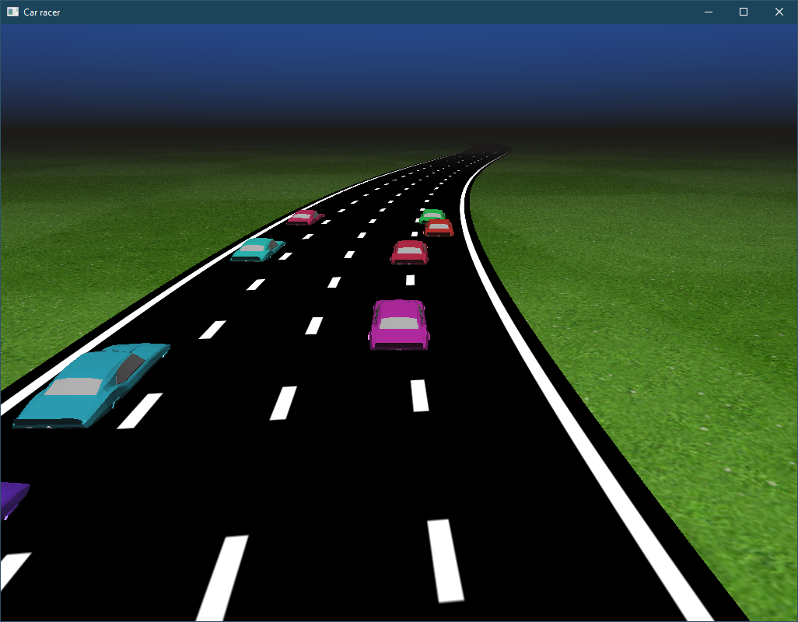

# Computer Graphics assignment 2020 
**Name**: Phiona Worship \
**Student ID**: 213016

## Setup
The project was written using Python 3.7.4 and requires the Python runtime installed and following packages:
 - glfw
 - PyGLM
 - PyOpenGL
 - glm
 - numpy
 - pywavefront

To install them at once, you can call

```
pip install glfw PyGLM PyOpenGL glm numpy pywavefront
```

## Running
To run the application, execute `python3 main.py` in the project root folder.

The application consists of some cars racing along an infinite track, switching lanes, overtaking and lagging behind. \
The user can use the `c` button to switch between the available camera angles.

## Screenshot



## Tweaking
The file `main.py` contains variables that can be changed to tweak the simulation. The following table summarizes these variables.

Name | Meaning | Default value
:-:|:-:|:-:
num_cars | Number of cars |  13
max_y | Maximum distance between first and last car |  14
lanes | Number of lanes |  4
arc_len | The length of traced track |  0.15
car_size | Scaling of cars |  0.03
car_speed | Speed of cars |  0.3
lane_width | The width of lanes |  0.2

## Modules
The code is structured into python modules. Below is a description of each module.

**camera**: Defines a typical 3D camera class, `camera`, that can calculate the view and projection matrices using `glm`.

**cube**: Defines a single class, `cube` that displays a cube, using the car shaders. It was used for development, before the model loader and is now unused.

**draw**: Stores data needed for drawing a model with Phong shading. Namely the Vertex Array Object, the vertex count and the shading colors.

**envbox**: Renders a huge skybox using the envbox shaders. Also loads the grass texture using `PIL.Image` and uploads it to the GPU.

**main**: The heart of the application. Opens a window using `glfw`, creates and manages car states and uses these states to render cars at their correct position. Also manages an `envbox`, and a `road` object, and renders using a `camera`. This file contains variables that can be tweaked (see above). 

**model**: Loads an obj model using `pywavefront` and uploads every mesh in the scene defined by the obj, creating a VAO for each of them. This way the colors of the object can be changed.

**road**: Creates a large 2xN grid with integer coordinates, that will be rendered with the road shaders.

## Shaders
The real graphics happen in the shaders. I employed some tricks to make the simulation easier to code. All shaders are written against the GLSL 3.3 core standard. The shader files are located in the `shaders` folder.

**car**: The car shader renders the given geometry using the Phong shading model.

**envbox**: This is a more complex shader than the car shader. It calculates a ray direction from the camera and if that direction is above the horizon, it mixes three colors to simulate sky color. \
If the direction points below the horizon, then the 2D point on plane Y=0 and view ray is determined and its x and z coordinates are used to sample the grass texture, resulting in the environment around the road. \
A checkerboard pattern is applied to the grass to make it look less repeating. \
Fog is applied to the grass.

**road**: This shader's input space is the 2xN integer lattice, which is transformed using the same function that `main.py` uses to displace cars, to form the shape of the road. \
The integer lattice can be treated as a UV coordinate and thus enables us to create procedural stripes. these are also antialiased. 

## Acknowledgement
The car model and the grass texture are free assets acquired from the sources:

 - car: https://www.freelancer.hu/contest/Toon-grass-texture-k-tileable-1437066-byentry-24207508?ngsw-bypass=&w=f
 - grass: https://free3d.com/3d-model/chevrolet-camaro-ss-coupe-373476.html
